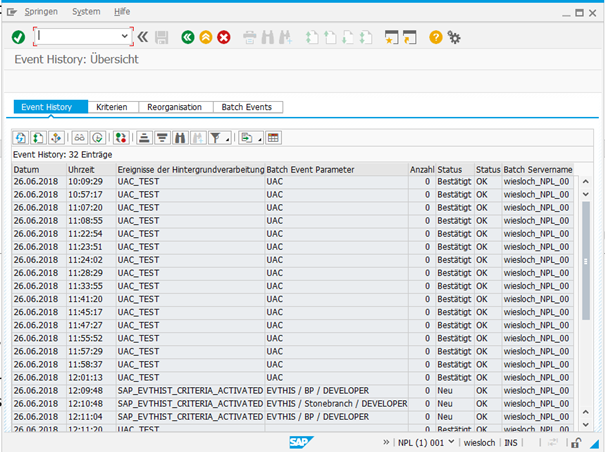

# ut-sap-eventmonitor-linux
# Abstract: 

The here described Universal Tasks Queries the SAP Event history table for the selected SAP Event & Parameter. If the Event is found, it gets confirmed, so that it is not triggered again. Optionally a task can be launched, based on the occurrence of an Event & Parameter.

# 1.	Disclaimer

No support and no warranty are provided by Stonebranch GmbH for this document and the related Universal Task. The use of this document and
the related Universal Task is on your own risk.

Before using this task in a production system, please perform extensive testing.

Stonebranch GmbH assumes no liability for damage caused by the performance of the Universal Tasks

# 2. Scope

This document provides a documentation how to install and use the Universal Tasks for SAP Event Monitoring.  

# 3.	Introduction

Some details about the Universal Tasks for SAP Event Monitoring

- The Universal Task will monitor the SAP Event history table for a certain event and related parameter.
- For the Parameters wildcards “*” are supported
-	The Event is retrieved by calling the USAP command: “display event_history” 
-	Once the Event and Parameter have been identified the Event is confirmed in SAP, so that the monitor will not trigger a second time (optional setting)
-	Once the Event and Parameter have been identified and confirmed the assigned task is started using the CLI command: ops-task-launch
-	If no task is specified, the UT runs in Monitoring mode and goes to success in case an Event has been identified
-	Currently only SAP connections via the sapnwrfc.ini destination file is supported. Please contact Stonebranch, if a Version for standard SAP Application Server connection is required (minimal efforts).
-	You can create a Task Monitor trigger out of this task by adding an action to the Universal Task, which re-started the task in case of success.
-	You can set different log-levels for the Universal task, providing you more information in case of issues
-	This Universal Task been added to the CTK-Conversion tool to map automatically Tivoli Workload Scheduler Sap Monitors called: eventProvider="SapMonitor" towards this UT.

# 4. Installation
# 4.1	Software Requirements

**Universal Task name:** ut-sap-eventmonitor-linux

**Related UAC XML Files for template and task: Github repository**

**Software used:**
For the set-up you need:
1.	Universal Connector for SAP installed on a Linux Server 
2.	An SAP destination configured in sapnwrfc.ini (/opt/universal/uagsrv)
3.	The Universal Task is based on a bash shell script and awk

# 4.2	Installation Steps

The following describes the installation steps:

**1.	Install Python 3.6.3 for Windows on SAP Data Services Server**

Official Download link: https://www.python.org/downloads/

Note: 
Install Python with the options: 
-	add python to windows path
-	Install for all users

**2.	Install the Universal Agent on the SAP Data Services Server**

Download the latest Universal Agent from the Stonebranch Customer Portal and install the Universal Agent on the SAP Data Services
Server.

Please refer to the Universal Agent Installation Manual [3] for details. 

**3.	Import the Universal Task including the Universal Template to your Controller**

Go to “All Tasks” and load via the Import functionality the Universal Task configuration XML files into the Controller. 

Image 1 

   
Image 2  

# 5	Universal Task Configuration

**1.	Activate: Resolvable Credentials in Universal Automation Center:**

Image 3

**2.	Fill Out the Universal Task for each Data Service Job to be scheduled:**
In the example the SAP Event: UAC_TEST with Parameter: UAC is monitored.
If the Event occurs in the SAP Event history table with status “NEW” the Task “Sleep 600” is launched and the Event is confirmed in SAP.

Image 4

Fill out or select the required Credentials for SAP and the Universal Controller cli (oms credentials)
Example: Universal Controller cli (oms credentials) credentials:

Image 5

Example: SAP Credentials:

Image 6

# 6 Universal Tasks for SAP Event monitoring

TThe following chapter describes the provided SAP Event monitoring UT. 

Image 7

Field Description

Image 8

**Event configuration in SAP**

The SAP Task Monitor scans for Events in the SAP Event history. An Event only shows up in the Event history if an appropriate event criteria profile has been set-up in SAP by using transaction SM62. (Note: optionally a criteria profile can also be set-up via an SAP Task of command group “Set CM Profile” in the Universal Controller). The following screen shows an example of the set-up in SAP using SM62:

Image 9

**Event History table:**

The following provides and example of the Event history table in SAP (SM62).
Only Event showing up here can trigger the SAP Event Monitor UT.

Image 10

# 6.1	Task Monitor Trigger mode
You can create a Task Monitor trigger out of this task by adding an action to the Universal Task, which re-started the task in case of success.

Image 11

# 7	Test Cases

The following basic test cases has been performed:

Image 12

Image 13

# 8	Document References

There are no document references.
